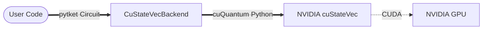

---
hide:
  - navigation
  - toc
edit_uri: ""
---

<div class="hero-container">

  <div class="hero-title-group">
    
    <h1>pytket-custatevec</h1>
  </div>

  <p class="tagline">GPU-accelerated statevector and shot-based simulation for pytket.</p>

  <div class="hero-actions">
    <a href="installation/" class="btn btn-primary">Get Started</a>
    <a href="examples/" class="btn btn-secondary">View Examples</a>
  </div>

</div>

<div class="external-badges">
  <a href="https://github.com/quantinuum/pytket-custatevec/actions">
    
  </a>

  <a href="https://pypi.org/project/pytket-custatevec/">
    
  </a>

  <a href="https://github.com/quantinuum/pytket-custatevec/blob/main/LICENSE">
    
  </a>

  <a href="https://pepy.tech/project/pytket-custatevec">
    
  </a>

  <a href="https://tketusers.slack.com/">
      
  </a>

  <a href="https://quantumcomputing.stackexchange.com/questions/tagged/pytket">
      
  </a>
</div>

`pytket-custatevec` acts as an open-source bridge between Quantinuum's [pytket](https://tket.quantinuum.com/) compiler and NVIDIA's [cuQuantum](https://developer.nvidia.com/cuquantum-sdk) SDK, enabling massive speedups for circuit simulations.

---

## Why use this backend?

<div class="grid cards" markdown>

-   :material-speedometer: **High Performance**
    ---
    Leverage NVIDIA GPUs to enable rapid simulation of quantum circuits using parallel architecture.

-   :material-layers-triple: **Seamless Integration**
    ---
    Works as a standard `pytket` Backend. Just switch your backend import, and your existing code runs on the GPU immediately.

-   :material-memory: **Optimized Memory**
    ---
    Utilizes `cuStateVec`'s advanced memory management to handle large statevectors efficiently on GPU VRAM.

</div>

## Architecture

This library sits directly on top of the NVIDIA cuQuantum stack.



## Bugs and Support

This is a community-driven project. Please file bugs and feature requests on the [GitHub Issue Tracker](https://github.com/quantinuum/pytket-custatevec/issues).

<!-- ## Citing

If you use `pytket-custatevec` in your research, please cite it as follows:

```bibtex
@software{pytket_custatevec,
  author = {{The pytket-custatevec Developers}},
  title = {pytket-custatevec: GPU-accelerated statevector simulation},
  url = {[https://github.com/quantinuum/pytket-custatevec](https://github.com/quantinuum/pytket-custatevec)},
  year = {2025}
}
``` -->
